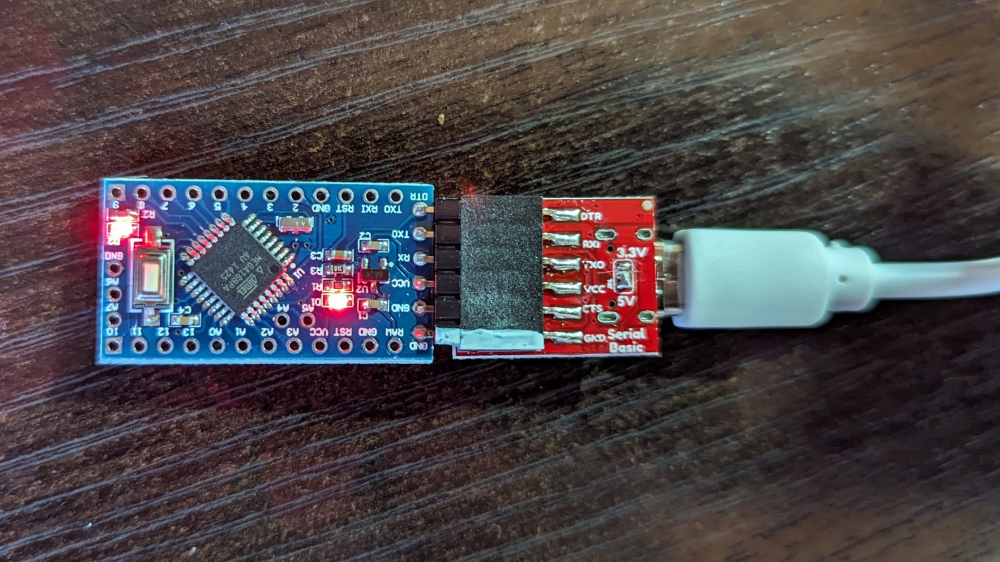
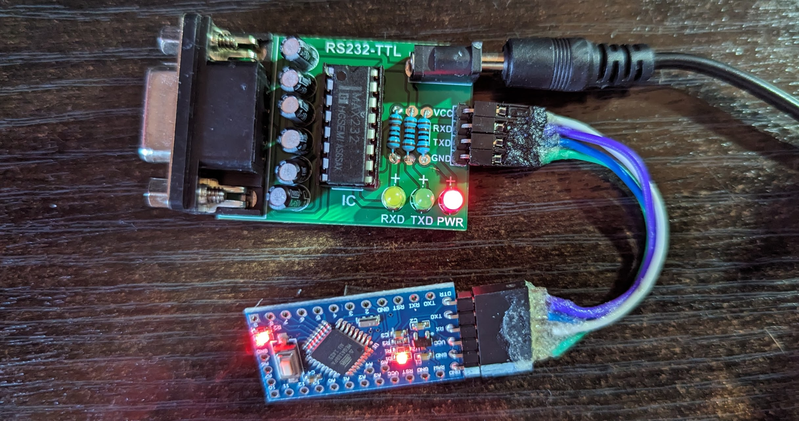
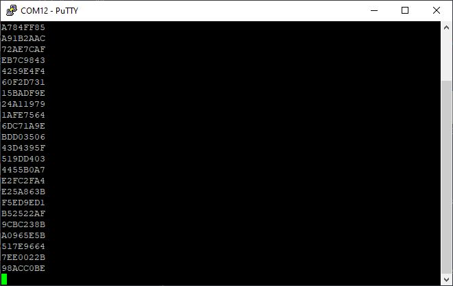

# randdev
Random Number Device

### Features
* RS232 serial line interface (default: 9600N1)
* unsigned long values, 6 hex digits (default: every second)
* no seed
* random analog source with CRC32 processing
* minimal control commands

### Control / Commands
* general commands:
  * [i]nfo - name and short help
  * [h]elp - name and short help
  * [t]est - output CRC32 test and min/max of random values
  * [d]ebug - show internal values, e.g. random analog input
* control output:
  * [l]oop - one value every second
  * [f]ast - values as fast as possible
  * [s]top - stop output (once per day)
  * [r]equest / [?] - request single value
* hex values format
  * (X) - upper case
  * (x) - lower case
* change baud rates: [1]9200, [2]8800, [3]8400, [5]7600, [9]600

  
### Building
* used an Ardunio Nano for prototyping
  * check: old bootloader?
* Arduino Pro Mini / Pollin Entwicklungsboard ATmega 168PA
  * check: 328 / 168? 3.3 V / 5 V?
 
* programming via FTDI Cable / USB module 

* building stand-alone device with MAX232 module
  * case?
  * plug for power supply wobbly, solder
    

* output in terminal window

 

### Todo / Open:
* external analog noise source?
* case

   

